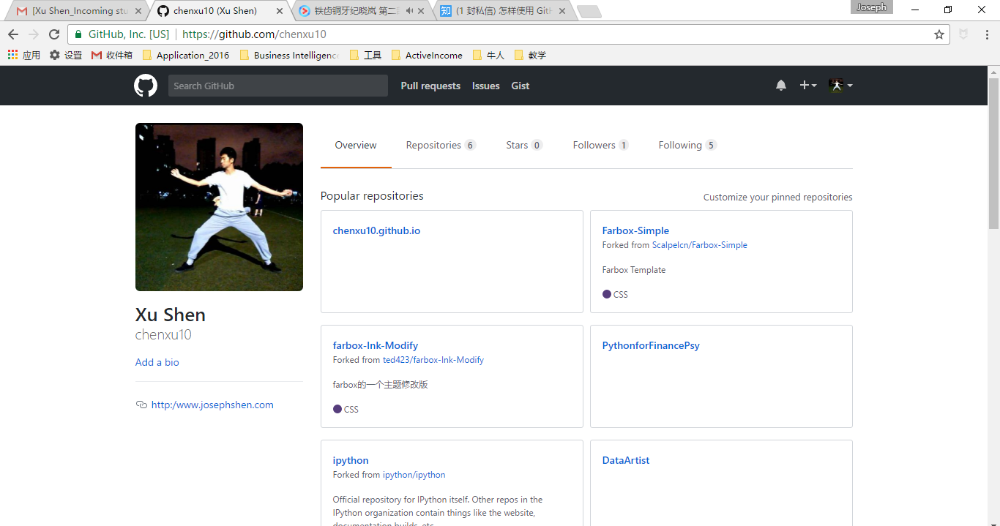

# 第三关：小白的Git与Github入门之路(Push and Pull)

## Git简介

### 什么是Git?

Git是世界上最先进的分布式版本管理系统。

### 集中式版本管理系统与分布式版本管理系统？

集中式版本管理系统

+ 版本库集中在中央服务器
+ 必须联网才能工作

分布式版本管理系统

+ 每个人的电脑都有一个完整的版本库
+ 方便进行分支管理

## 在Window上安装Git与配置

### 第一步：官网下载软件

### 第二步：在Git bash上自报家门

## 创建版本库——把文件放入版本库

+ 把文件添加到仓库
+ 把文件提交到仓库

## 修改文件，掌握状态与修改内容

+ git status掌握仓库目前的状态
+ git diff看看修改的内容

## 远程仓库出现：Github登场

Git是分布式版本管理系统，同一个Git仓库，可以分布到不同的机器上。

Github提供仓库托管服务，注册github账号就可以免费获得Git远程仓库。

浏览Github主页，熟悉结构。

+ 创建SSH Key
+ 在Github进行设置

## 添加远程仓库，并把本地内容推送到远程仓库

+ Create new repistory
+ Create a readme.md
+ Push
+ Modfy readme.md add hyperlink
+ Add and commit
+ Push again

## Fork别人的库以及克隆这个库到本地

+ Fork repository
+ Clone repository to local
+ Pull request

## 分支管理

+ 创建分支dev
+ 提交并合并到Master分支
+ 切换回Master分支并合并分支到Master分支
+ 删除dev分支

## Github可以用来做些什么？

+ 借助GitStats进行编程的刻意练习统计
+ 技术类图书的写作
+ 健身:[hoosin/EveryDaySport · GitHub**](https://link.zhihu.com/?target=https%3A//github.com/hoosin/EveryDaySport)
+ Github+Jekyll进行博客与个人主页的搭建
+ Openscience
+ 找到有用的第三方库和包

## 

